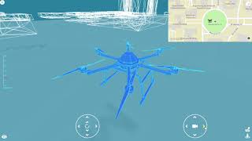

# DroneVR: A Web Virtual Reality Simulator for Drone Operator
## Abstract
In recent years, Unmanned Aerial Vehicle (UAV) has been used extensively in various applications from entertainment, virtual tourism to construction, mining, agriculture. Navigation, path planning, and image acquisition are the main tasks in administering these aerial devices in accordance with real-time object tracking for affordable aerial vehicles. Aircraft crash is one of the most critical issues due to the uncontrolled environment and signal loss that cause the aerial vehicle to hit the buildings on its returning mode. Furthermore, real-time image processing, such as object tracking, has not yet been exploited for a low-cost aerial vehicle. This paper proposes a prototype embedded in a Web-based application called DroneVR to mitigate the aforementioned issues. The virtual reality environment was reconstructed based on the real-world fly data (OpenStreetMap) in which path planning and navigation were carried out. Gaussian Mixture Model was used to extract foreground and detect a moving object, Kalman Filter method was then applied to predict and keep track of object's motion. Perceived ease of use was investigated with a small sample size users to improve the simulator.

## Demonstration
Demo link: https://alex-nguyen.github.io/DroneVR/

Demo Video:

